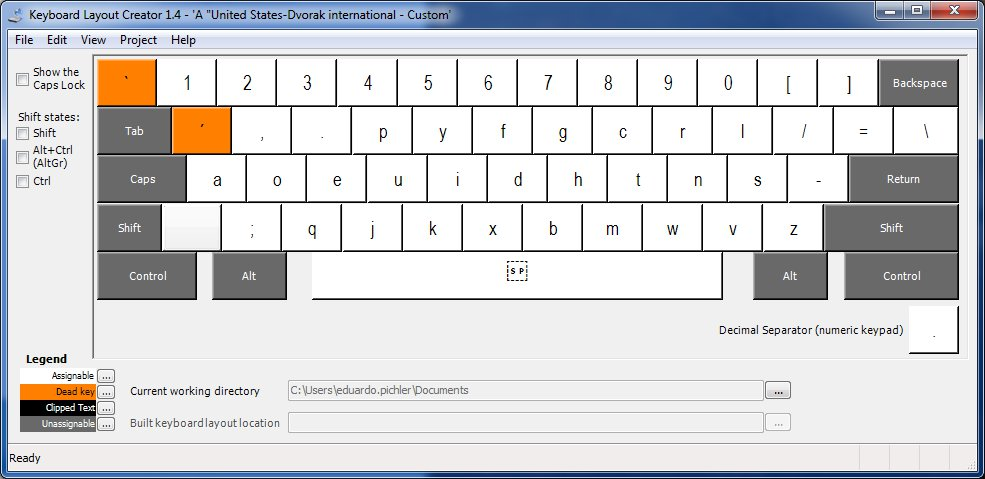

#Dvorak International Layout for Apple Bluetooth Keyboards on Windows#

You can use your Apple Bluetooth Keyboard with Dvorak layout, under Windows 7.

##How to use##
1. Install the Dvorak layout. It's located in the **dist** folder. 
 * But if you want to compile by yourserlf, just use the "Windows Keyboard Layout Editor" ( Keyboard Layout Editor installer installer folder) and open the **.klc** file.
2. Open your Windows Keyboard Preferences, and choose the new layout you installed.
3. Execute the .exe located in the Auxiliar Software folder. It's necessary to have the `fn` key working.

Now you can use the Apple Dvorak Keyboard.

##Tips##
1. To active and deactive the `Insert` key, just hold `fn` and press `Enter`.
2. For a better use, you need to execute the auxiliar software (Auxiliar Software folder) each time Windows starts.
3. If your computer wake up without the `fn` key working, you can refresh the connection (an Auxiliar Software feature) and it will work again, like in the image:

##Known issues##
1. In some cases, on the Login prompt of Windows change the layout to default. After you log in, Dvorak layout is actived automatically.

